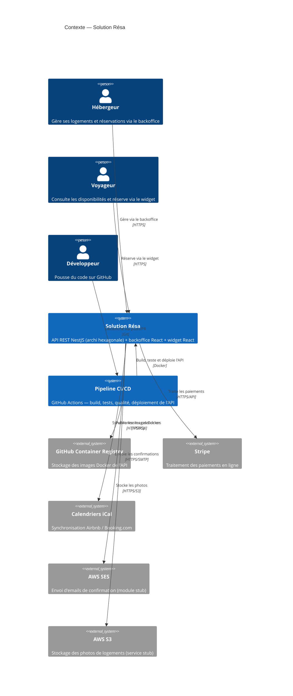
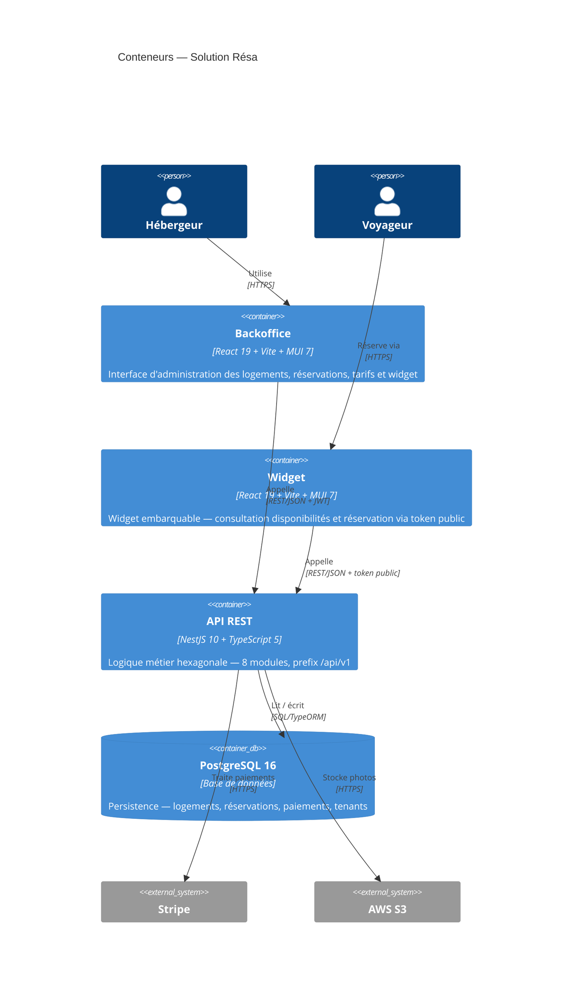
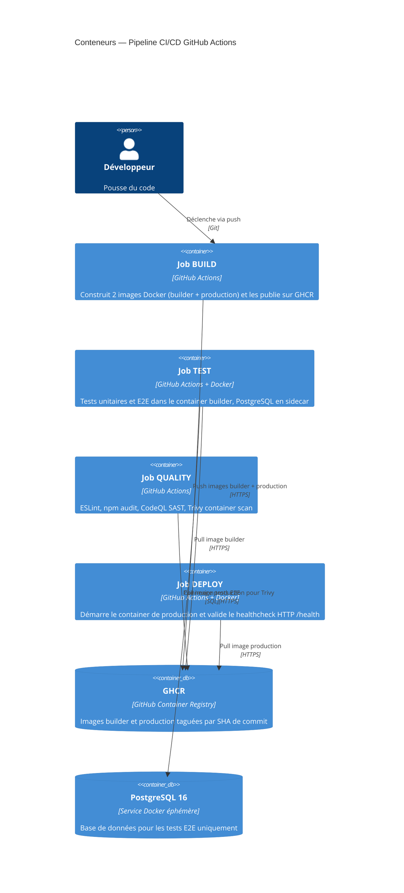

# Cartographie — Architecture de la solution

## C'est quoi le modèle C4 ?

Le modèle C4 est une façon standardisée de représenter l'architecture d'un système à différents niveaux de zoom. Le niveau C1 montre le système dans son environnement global, le niveau C2 détaille les briques internes. Cela permet à n'importe quel collaborateur de comprendre l'architecture sans avoir besoin de lire le code.

## Niveau C1 — Contexte système

## Niveau C2 — Conteneurs de la solution

## Niveau C2 — Conteneurs du pipeline CI/CD

## Flux d'exécution du pipeline

```mermaid
flowchart LR
  push([Push / PR]) --> build

  subgraph "Stage 1"
    build[BUILD\nDockerfile multi-stage\nPush GHCR]
  end

  subgraph "Stage 2 - Parallèle"
    test[TEST\nTests unitaires Jest\nTests E2E Supertest\nRapport couverture]
    quality[QUALITY\nESLint\nnpm audit\nCodeQL\nTrivy]
  end

  subgraph "Stage 3 - main only"
    deploy[DEPLOY\nStart container prod\nHealthcheck GET /health]
  end

  build --> test
  build --> quality
  test --> deploy
  quality --> deploy
```

